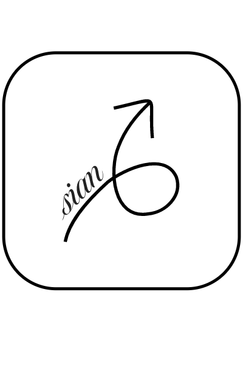
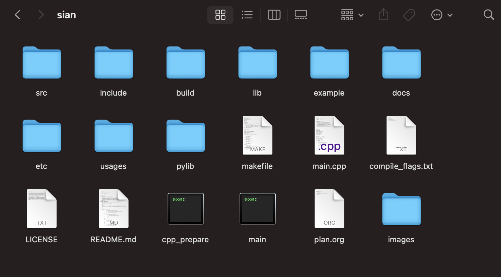

<!-- 
	***
	*   README.md
	*	
	*	Author: Jeong Hoon (Sian) Choi
	*	License: MIT
	*	
	***
-->
<a name="readme-top"></a>

<br/>
<div align="center">
	<a href="https://github.com/csian98/sian">
		
	</a>
	<h3 align="center">sian</h3>	
	<a href="mailto:csian7386@gmail.com"></a>
	<a href="https://instagram/csian98"></a>
	<a href="https://discord.gg/YhghyDBgKa"></a>
	<a href="https://csian98.github.io"></a>
	<a href="https://www.linkedin.com/in/csian98"></a>
	<a href="https://patreon.com/csian98"></a>
	<p align="center">
	Source code and Libraries for C++, CUDA, Python Linux development environment
	<br/>
	<br/>
	<a href="https://github.com/csian98/sian">
		<strong>Explore the docs »</strong>
	</a>
	<br/>
	<br/>
	<a href="https://github.com/csian98/sian/issues/new?labels=bug&template=bug-report---.md">Report Bug</a>
	·
	<a href="https://github.com/csian98/sian/issues/new?labels=enhancement&template=feature-request---.md">Request Feature</a>
	</p>
</div>

<details>
	<summary>Table of Contents</summary>
	<ol>
		<li>
			<a href="#about-the-project">About The Project</a>
			<ul>
				<li><a href="#development-environment">Development Environment</a>
			</ul>
			<ul>
				<li><a href="#built-with">Built With</a></li>
			</ul>
		</li>
		<li>
			<a href="#getting-started">Getting Started</a>
			<ul>
				<li>
					<a href="#prerequisites">Prerequisites</a>
				</li>
				<li>
					<a href="#installation">Installation</a>
				</li>
			</ul>
		</li>
		<li>
			<a href="#usage">Usage</a>
		</li>
		<li>
			<a href="#roadmap">Roadmap</a>
		</li>
		<li>
			<a href="#license">License</a>
		</li>
		<li>
			<a href="#contact">Contact</a>
		</li>
  </ol>
</details>

## About The Project

![Language][language-shield]
![repo size][repo-size-shield]
![weekly commits][commit-activity-shield]
![last commit][last-commit-shield]
[![MIT License][license-shield]][license-url]



The sian repository was created for personal library purposes.
Provides code templates for C++, CUDA, and Python development environments that can be used when managin source codes as a direct file instead of a separate IDE project.

### Development Environment
* [![macOS][macos-shield]][macos-url]
* [![Arch Linux][archlinux-shield]][archlinux-url]
* [![Nvidia Cuda][cuda-shield]][cuda-url]

### Built With
* [![openSSL][openssl-shield]][openssl-url]
* [![curl][curl-shield]][curl-url]
* [![mariaDB][mariadb-shield]][mariadb-url]
* [![Slack API][slack-shield]][slack-url]
* [![OpenAI API][openai-shield]][openai-url]

<p align="right">(<a href="#readme-top">back to top</a>)</p>

## ⚓ Getting Started

Makefile source code is provided for use in the GCC or Clang Development environment.
If Nvidia's nvcc is present in the system, compile the cuh header file and cu source code together.

The _*.h_ extension is a header file extension for all C, C++, and CUDA, and in the case of code required at compile time, such as templates and inline functions, the code was provided at compile time through _*.hpp_ or _*.cuh_ files.

⚠️ All codes were written based on the author's learning purposes, and it is clearly stated that the codes are not suitable for actual development environments.

### Prerequisites

*.key, *.scr, and *.crt files are required for encrypted network communication SSL protocol
* openssl
  ```sh
  openssl genrsa -out [filename] [numbits default: 512]
  openssl rsa -in [keyfile] -out [keyfile] [encrypt-algorithm recommend: aes256]
  openssl rsa -in [privatekey] -pubout -out [publickey]
  
  openssl req -new -key [keyfile] -out [csr filename]
  
  openssl x509 -req -days [expire period] -in [csr file] -signkey [keyfile] -out [crt file]
  ```
  
* nvidia
  ```sh
  sudo pacman -Syu cuda-tools nvidia-utils
  ```

### Installation

1. Clone the repo
   ```sh
   git clone https://github.com/csian/sian.git
   ```
2. Write down your environment on makefile
   ```sh
   cd sian
   emacs makefile
   ```
3. Compile
   ```sh
   make				# build sian/lib/libsian.a
   make exec		# build elf or machO with sian/main.cpp
   make exec_debug	# build elf or machO with sian/main.cpp for debugging(-g)
   ```

<p align="right">(<a href="#readme-top">back to top</a>)</p>

## 📌 Usage

The _*.cpp_ code files in _sian/usages_ contains example codes that use the library.
Each code has an Entry Point that includes the main function.

_For more examples, please refer to the [usages](https://github.com/csian98/sian/tree/main/usages)_

<p align="right">(<a href="#readme-top">back to top</a>)</p>

## 🗺️ Roadmap

- [X] makefile, *.h, *.cpp, *.hpp, *.cuh, *.cu templates
- [ ] utilities including timers and memory & thread pool
- [ ] network protocols such as tcp, ssl, curl, etc.
  - [ ] c2c server
- [ ] non-standard data structures
  - [ ] B-tree
  - [ ] Red Black tree
- [ ] standard library extension header
  - [ ] allocator
  - [ ] hash_functions
- [X] Unit test code

See the [open issues](https://github.com/csian98/sian/issues) for a full list of proposed features (and known issues).

<p align="right">(<a href="#readme-top">back to top</a>)</p>

## 🔐 License

Copyright © 2024, *Jeong Hoon Choi* or *Sian*. All rights reserved
Distributed under the MIT License. See `LICENSE` for more information.

<p align="right">(<a href="#readme-top">back to top</a>)</p>

## 📞 Contact

Jeong Hoon (Sian) Choi - [@csian98](https://instagram.com/csian98) - [csian7386@gmail.com](mailto:csian7386@gmail.com)

Project Link: [https://github.com/csian98/sian](https://github.com/csian98/sian)

<p align="right">(<a href="#readme-top">back to top</a>)</p>

[language-shield]: https://img.shields.io/github/languages/top/csian98/sian.svg?style=for-the-badge
[code-size-shield]: https://img.shields.io/github/languages/code-size/csian98/sian.svg?style=for-the-badge
[repo-size-shield]: https://img.shields.io/github/repo-size/csian98/sian.svg?style=for-the-badge
[commit-activity-shield]: https://img.shields.io/github/commit-activity/w/csian98/sian.svg?style=for-the-badge
[last-commit-shield]: https://img.shields.io/github/last-commit/csian98/sian.svg?style=for-the-badge
[license-shield]: https://img.shields.io/github/license/csian98/sian.svg?style=for-the-badge
[license-url]: https://github.com/csian98/sian/blob/main/LICENSE

[macos-shield]: https://img.shields.io/badge/mac%20os-000000?style=for-the-badge&logo=macos&logoColor=F0F0F0
[macos-url]: https://developer.apple.com/macos
[archlinux-shield]: https://img.shields.io/badge/Arch%20Linux-1793D1?logo=arch-linux&logoColor=fff&style=for-the-badge
[archlinux-url]: https://archlinux.org
[cuda-shield]: https://img.shields.io/badge/NVIDIA%20CUDA-RTX4060-76B900?style=for-the-badge&logo=nvidia&logoColor=white
[cuda-url]: https://docs.nvidia.com/cuda/cuda-c-programming-guide/

[sqlite-shield]: https://img.shields.io/badge/sqlite-%2307405e.svg?style=for-the-badge&logo=sqlite&logoColor=white
[mariadb-shield]: https://img.shields.io/badge/MariaDB-003545?style=for-the-badge&logo=mariadb&logoColor=white
[mariadb-url]: https://mariadb.com/docs/server/connect/
[mongodb-shield]: https://img.shields.io/badge/MongoDB-%234ea94b.svg?style=for-the-badge&logo=mongodb&logoColor=white
[slack-shield]: https://img.shields.io/badge/Slack%20API-4A154B?style=for-the-badge&logo=slack&logoColor=white
[slack-url]: https://api.slack.com
[openai-shield]: https://img.shields.io/badge/openAI%20API-74aa9c?style=for-the-badge&logo=openai&logoColor=white
[openai-url]: https://platform.openai.com/docs/api-reference

[openssl-shield]: https://img.shields.io/badge/OpenSSL-721412?style=for-the-badge&logo=OpenSSL
[openssl-url]: https://www.openssl.org
[curl-shield]: https://img.shields.io/badge/curl-073551?style=for-the-badge&logo=curl
[curl-url]: https://curl.se

[hadoop-shield]: https://img.shields.io/badge/Apache%20Hadoop-66CCFF?style=for-the-badge&logo=apachehadoop&logoColor=black
[tensorflow-shield]: https://img.shields.io/badge/TensorFlow-%23FF6F00.svg?style=for-the-badge&logo=TensorFlow&logoColor=white

[c-shield]: https://img.shields.io/badge/C-00599C?style=for-the-badge&logo=c&logoColor=white
[cpp-shield]: https://img.shields.io/badge/C%2B%2B-00599C?style=for-the-badge&logo=c%2B%2B&logoColor=white
[python-shield]: https://img.shields.io/badge/Python-FFD43B?style=for-the-badge&logo=python&logoColor=blue
[elisp-shield]: https://img.shields.io/badge/Emacs%20Lisp-%237F5AB6.svg?&style=for-the-badge&logo=gnu-emacs&logoColor=white
[r-shield]: https://img.shields.io/badge/R-276DC3?style=for-the-badge&logo=r&logoColor=white
[shell-shield]: https://img.shields.io/badge/Shell_Script-121011?style=for-the-badge&logo=gnu-bash&logoColor=white

[keras-shield]: https://img.shields.io/badge/Keras-%23D00000.svg?style=for-the-badge&logo=Keras&logoColor=white
[pytorch-shield]: https://img.shields.io/badge/PyTorch-%23EE4C2C.svg?style=for-the-badge&logo=PyTorch&logoColor=white
