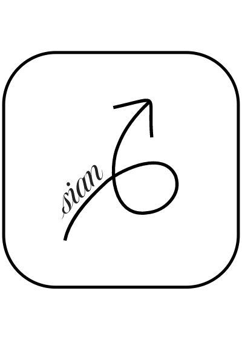

<!-- 
	***
	*   README.md
	*	
	*	Author: Jeong Hoon (Sian) Choi
	*	License: MIT
	*	
	***
-->
<a name="readme-top"></a>

<br/>
<div align="center">
	<a href="https://github.com/csian98/sian">
		
	</a>
	<h3 align="center">sian</h3>	
	<a href="mailto:csian7386@gmail.com"></a>
	<a href="https://instagram/csian98"></a>
	<a href="https://discord.gg/YhghyDBgKa"></a>
	<a href="https://csian98.github.io"></a>
	<a href="https://www.linkedin.com/in/jeong-hoon-choi-086b55288/"></a>
	<p align="center">
	Source code and Libraries for C++, CUDA, Python Linux development environment
	<br/>
	<br/>
	<a href="https://github.com/csian98/sian">
		<strong>Explore the docs »</strong>
	</a>
	<br/>
	<br/>
	<a href="https://github.com/csian98/sian/issues/new?labels=bug&template=bug-report---.md">Report Bug</a>
	·
	<a href="https://github.com/csian98/sian/issues/new?labels=enhancement&template=feature-request---.md">Request Feature</a>
	</p>
</div>

<details>
	<summary>Table of Contents</summary>
	<ol>
		<li>
			<a href="#about-the-project">About The Project</a>
			<ul>
				<li><a href="#development-environment">Development Environment</a>
			</ul>
			<ul>
				<li><a href="#built-with">Built With</a></li>
			</ul>
		</li>
		<li>
			<a href="#getting-started">Getting Started</a>
			<ul>
				<li>
					<a href="#prerequisites">Prerequisites</a>
				</li>
				<li>
					<a href="#installation">Installation</a>
				</li>
			</ul>
		</li>
		<li>
			<a href="#usage">Usage</a>
		</li>
		<li>
			<a href="#roadmap">Roadmap</a>
		</li>
		<li>
			<a href="#contributing">Contributing</a>
		</li>
		<li>
			<a href="#license">License</a>
		</li>
		<li>
			<a href="#contact">Contact</a>
		</li>
		<li>
			<a href="#acknowledgments">Acknowledgments</a>
		</li>
  </ol>
</details>

## About The Project

![Language][language-shield]
![repo size][repo-size-shield]
![weekly commits][commit-activity-shield]
![last commit][last-commit-shield]
[![MIT License][license-shield]][license-url]

[![Product Name Screen Shot][product-screenshot]](https://example.com)

The sian repository was created for personal library purposes.
Provides code templates for C++, CUDA, and Python development environments that can be used when managin source codes as a direct file instead of a separate IDE project.

### Development Environment
* [![macOS][macos-shield]][macos-url]
* [![Arch Linux][archlinux-shield]][archlinux-url]

### Built With
* [![openSSL][openssl-shield]][openssl-url]
* [![curl][curl-shield]][curl-url]
* [![mariaDB][mariadb-shield]][mariadb-url]

<p align="right">(<a href="#readme-top">back to top</a>)</p>

## Getting Started

Lorem Ipsum is simply dummy text of the printing and typesetting industry. Lorem Ipsum has been the industry's standard dummy text ever since the 1500s, when an unknown printer took a galley of type and scrambled it to make a type specimen book. It has survived not only five centuries, but also the leap into electronic typesetting, remaining essentially unchanged. It was popularised in the 1960s with the release of Letraset sheets containing Lorem Ipsum passages, and more recently with desktop publishing software like Aldus PageMaker including versions of Lorem Ipsum.

### Prerequisites

This is an example of how to list things you need to use the software and how to install them.
* npm
  ```sh
  npm install npm@latest -g
  ```

### Installation

1. Get a free API Key at [https://example.com](https://example.com)
2. Clone the repo
   ```sh
   git clone https://github.com/csian/sian.git
   ```
3. Install NPM packages
   ```sh
   npm install
   ```
4. Enter your API in `config.js`
   ```js
   const API_KEY = 'ENTER YOUR API';
   ```

<p align="right">(<a href="#readme-top">back to top</a>)</p>

## Usage

Lorem Ipsum is simply dummy text of the printing and typesetting industry. Lorem Ipsum has been the industry's standard dummy text ever since the 1500s, when an unknown printer took a galley of type and scrambled it to make a type specimen book. It has survived not only five centuries, but also the leap into electronic typesetting, remaining essentially unchanged. It was popularised in the 1960s with the release of Letraset sheets containing Lorem Ipsum passages, and more recently with desktop publishing software like Aldus PageMaker including versions of Lorem Ipsum.

_For more examples, please refer to the [usages](https://github.com/csian98/sian/tree/main/usages)_

<p align="right">(<a href="#readme-top">back to top</a>)</p>

## Roadmap

- [ ] makefile, *.h, *.cpp, *.hpp, *.cuh, *.cu templates
- [ ] network protocols such as tcp, ssl, curl, etc.
  - [ ] c2c server
- [ ] non-standard data structures
  - [ ] B-tree
  - [ ] Red Black tree
- [ ] standard library extension header
  - [ ] allocator
  - [ ] hash_functions
- [ ] memory & thread pooling

See the [open issues](https://github.com/csian98/sian/issues) for a full list of proposed features (and known issues).

<p align="right">(<a href="#readme-top">back to top</a>)</p>

## Contributing

<p align="right">(<a href="#readme-top">back to top</a>)</p>

## License

Copyright © 2024, *Jeong Hoon Choi* or *Sian*. All rights reserved
Distributed under the MIT License. See `LICENSE` for more information.

<p align="right">(<a href="#readme-top">back to top</a>)</p>

## Contact

Jeong Hoon (Sian) Choi - [@csian98](https://instagram.com/csian98) - [csian7386@gmail.com](mailto:csian7386@gmail.com)

Project Link: [https://github.com/csian98/sian](https://github.com/csian98/sian)

<p align="right">(<a href="#readme-top">back to top</a>)</p>

## Acknowledgments

* []()
* []()
* []()

<p align="right">(<a href="#readme-top">back to top</a>)</p>

[language-shield]: https://img.shields.io/github/languages/top/csian98/sian.svg?style=for-the-badge
[code-size-shield]: https://img.shields.io/github/languages/code-size/csian98/sian.svg?style=for-the-badge
[repo-size-shield]: https://img.shields.io/github/repo-size/csian98/sian.svg?style=for-the-badge
[commit-activity-shield]: https://img.shields.io/github/commit-activity/w/csian98/sian.svg?style=for-the-badge
[last-commit-shield]: https://img.shields.io/github/last-commit/csian98/sian.svg?style=for-the-badge
[license-shield]: https://img.shields.io/github/license/csian98/sian.svg?style=for-the-badge
[license-url]: https://github.com/csian98/sian/blob/main/LICENSE

[macos-shield]: https://img.shields.io/badge/macOS-000000?logo=macOS
[macos-url]: https://developer.apple.com/macos
[archlinux-shield]: https://img.shields.io/badge/Arch%20Linux-1793D1?logo=Arch%20Linux
[archlinux-url]: https://archlinux.org

[sqlite-shield]: https://img.shields.io/badge/SQLite-003B57?logo=SQLite
[mariadb-shield]: https://img.shields.io/badge/MariaDB-003545?logo=MariaDB
[mariadb-url]: https://mariadb.com
[slack-shield]: https://img.shields.io/badge/Slack-4A154B?logo=Slack
[OpenAI-shield]: https://img.shields.io/badge/OpenAI-412991?logo=OpenAI

[openssl-shield]: https://img.shields.io/badge/OpenSSL-721412?logo=OpenSSL
[openssl-url]: https://www.openssl.org
[curl-shield]: https://img.shields.io/badge/curl-073551?logo=curl
[curl-url]: https://curl.se

[hadoop-shield]: https://img.shields.io/badge/Apache%20Hadoop-66CCFF?logo=Apache%20Hadoop
[tensorflow-shield]: https://img.shields.io/badge/TensorFlow-FF6F00?logo=TensorFlow
[keras-shield]: https://img.shields.io/badge/Keras-D00000?logo=Keras
[pytorch-shield]: https://img.shields.io/badge/PyTorch-EE4C2C?logo=PyTorch
